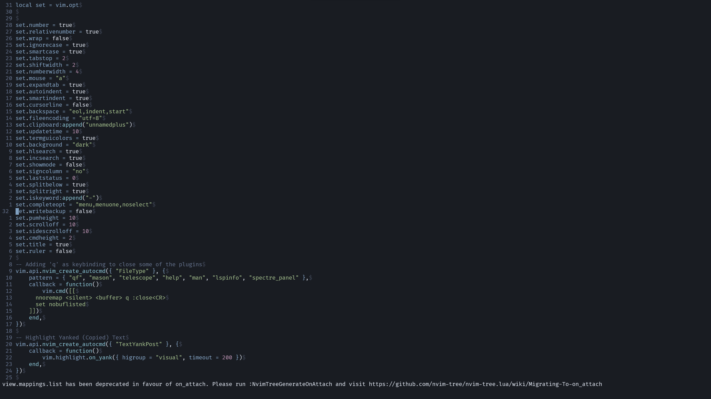
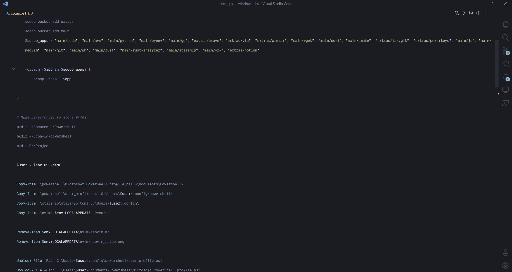
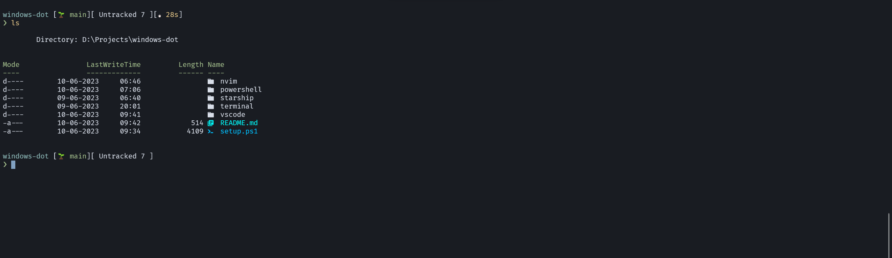

<h1 align="center">Windows Dotfiles </h1>

This is dotfiles for my Windows Machine

## Installation

- Run the command as an administrator
```powershell

./setup.ps1

```

## Configs

- [Neovim](./nvim/Neovim.md)
- [Visual Studio Code](./vscode/Code.md)
- [Windows Terminal](./terminal/settings.json)
- [Starship Prompt](./starship/starship.toml)
- [Powershell](./powershell/user_profile.ps1)

## Screenshots
### Neovim

### Code


### Windows Terminal
